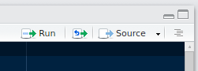

# Introduction to R for Data Analysis

Some of the material is repurposed from [the Data Carpentry lesson on Ecology](http://www.datacarpentry.org/R-ecology-lesson/02-starting-with-data.html), which is released under an open license.

## Overview

The goal of this lesson is to introduce the R programming environment for the express purpose of importing data and performing diagnostic, data cleaning tasks, and basic analysis tasks.
R is commonly used in many scientific disciplines for statistical analysis.
This workshop will focus on R as a general purpose programming language and data analysis tool, not on any specific statistical analysis.

### Dependencies

You may want to make sure you have these packages install ahead of time.

```r
install.packages('RSQLite')
```

## Contents

<!--TODO-->

## Introduction to RStudio

**RStudio is what we would call an interactive development environment, or IDE, for the R programming language.**
It is *interactive* because we can issue it commands in the R language and the program responds with output.
It is a *development environment* because we can use its features to develop scripts or programs in R that may consist of multiple R commands.

### RStudio Layout

**Open the RStudio program if you haven't already.**

* The interactive R console (left side of screen)
* Workspace and history (tabbed in upper right)
* Files/ Plots/ Packages/ Help (tabbed in lower right)

If we open a text file that contains an R program, what would we call an *R script,* a new pane would appear that displays the contents of that R script.
**R scripts are just plain text files but they have a \*.R file extension to indicate that the contents should be interpreted as R commands.**

### Workflow in RStudio

The basis of programming is that we write down instructions for the computer to follow and then we tell the computer to follow those instructions.
We call the instructions *commands* and we tell the computer to follow the instructions by *executing* or *running* those commands.

**Generally speaking, there are two ways we can execute commands in RStudio.**
One way is to use RStudio **interactively,** as I alluded to earlier.
That is, we can test R commands in the **R console** at the bottom right and maybe save those commands into an R script to run later.
This works just fine but it can be tedious and error-prone.
A better way would be for us to compose our R script in the file pane and then run the commands as a script or line-by-line.

To execute commands from the file pane in R, use the **Run** button at the top right.



## Introduction to R

R is a general purpose programming language that can be used to do almost anything with a computer.
However, like all languages, R is best used for only certain tasks.
Today, we'll learn some of R's basic and general features but we'll begin moving toward using R specifically as a data analysis and visualization environment.

### R as Calculator

At its most basic, R can be used as a calculator, employing many mathematical symbols and operators you've probably already seen.

```r
3 + 4
5 * 5
5^2
```

Just as in reading or writing math, we can use parentheses in R to make math statements in R easier to read and to ensure that we get the right result.

```r
7 - (5 * 5)
(7 - 5) * 5
```

**In R, many mathematical functions are already built-in to the software.**
For instance, we can ask for the square root of a number using the `sqrt()` function.

```r
sqrt(25)
```

**In R, functions have names, like `sqrt` and can be "called" using a pair of parentheses following the name.**
Functions often take **arguments**, which go inside the parentheses.
Arguments are inputs to a function.
In the example above, the number `25` is the sole argument to the function `sqrt()`.

**To learn more about the function `sqrt()` and its arguments, we can look up the help documentation on that function.**

```r
?sqrt
```

There are a number of useful things to pay attention to in help documentation.

- **Description** tells you what the function does, under what conditions you might use it...
- **Usage** tells you how to call the function; literally, what it looks like when called in R.
- **Arguments** is a list of arguments the function takes; some are required and some are optional.
- **Details** provides more detailed information on a function, such as how it works and sometimes what it gives you in return. Some help documentation has a separate section called **Value** that describes what value the function returns.
- **Examples** at the bottom give you helpful code samples, which you can usually copy and paste and run immediately,

There's also a function called `help()` that does the same thing as the question mark.
It accepts the name of the function as its first argument.

```r
help(sqrt)
```

### Storing Values Using Assignment

We've seen how we can type commands into the R console, hit ENTER, and see the results of our commands.
To move forward, we need to learn how to save values and re-use them later.
Much like the `sqrt()` function has a name assigned to a value (a function), we can make up our own names and use them to store values.
**The names we'll use to store values are called variables, and the process of storing values in variables is generally referred to as assignment.**
Let's start by looking at another built-in name and its value.

```r
pi
```

**What's the purpose of having this name `pi` built into R?**

```r
cos(pi)
```

To store a new value in R, we use the **assignment operator**, `<-`.

```r
pi2 <- 2 * pi
cos(pi2)
```

**Variable names in R can contain any letters, numbers, the underscore, or the period character.**
R is probably the only programming language that allows you to use the period or dot character in a variable name.
For this reason, some R experts advise against using such variable names.

```r
x1 <- 3/4
my.parameter <- 'something'
my_parameter <- 'something else'
```

RStudio makes it easier to type this operator with a keyboard shortcut: [Alt] + [-].

#### Exercise: Predict the Output

Given:

```r
x2 <- x1
x2 <- x2 * 2
```

What will this produce?

```r
x1
```

We can check to see that a certain result is what we expect it to be by using comparison operators.

```r
x2 == 1.5
```

### Machine Precision

Recall our mathematical functions and `pi`.

```r
sin(pi)
```

**Why is the result of this line not equal to zero?**

When performing numerical calculations in a programming environment like R, particularly when working with important quantities like money, it's important to be aware of how the computer represents decimal numbers.
For various reasons we won't go into, computers typically only approximate decimal numbers when they're stored.
If we don't guard against this, we may see some surprising results.
Numbers that seem to be equal may actually have different underlying representations and therefore be different by a small margin of error (called *machine numeric tolerance*).

```r
0.1 == 0.3 / 3
```

**In general, don't use `==` to compare numbers unless they are integers. Instead, use the all `all.equal` function.**

```r
all.equal(0.1, 0.3 / 3)
all.equal(sin(pi), 0)
```

### Data Types

There are five (5) atomic data types in R.
We can use the `typeof()` to determine the type of a data value.

```r
# Double-precision (decimal numbers)
typeof(3.14159)

# Integers
typeof(5)
typeof(5L)

# Character strings
typeof("Hello, world!")

# Logical (Boolean)
typeof(TRUE)

# Complex numbers
typeof(2+3i)
```

### Functions

We've seen how we can store atomic values in variables and also how some variables refer to built-in functions.

```r
sqrt(25)
```

**How would describe the importance of having a function like `sqrt()` available in R? What is the general purpose of functions?**

We can use functions for a variety of reasons but the most important may be:

- To transform inputs in a consistent way;
- More generally, to package a workflow we want to perform multiple times in a consistent way;
- To allow us to repeat a task consistently without repeating a bunch of code.

**We can create our own functions in R using the `function` command.**
It is called in a way that is similar to calling a function itself.

```r
pow10 <- function (value) {
  10^value
}

pow10(1)
```

Note that the curly braces create what is sometimes called the **body** of the function.
We can just call it a **code block**.
Whatever happens inside those curly braces belongs to the function; its code that is executed when the function is called.

**Note that the function we just defined takes one argument, called value.**
We can define a function that takes multiple arguments.
For instance, *let's make a function that is more useful than `pow10()` because it allows us to specify the base.*

```r
pow <- function (exponent, base) {
  base^exponent
}

pow(1, 10)
```

**Sometimes it is useful to have an argument take on a default value.**

```r
pow <- function (exponent, base = 10) {
  base^exponent
}

pow(1)
```

**And sometimes it is more convenient to call a function with named arguments.**

```r
pow(1, base = 10)
```

Named arguments also allow us to specify the arguments in any order, but if we get a name wrong, we'll see an error.

```r
pow(base = 10, exponent = 1)
pow(base = 10, expont = 1)
```

**By default in R, the last line of a function's body or code block is what gets returned by that function.**
If we want to make it more clear what value our function returns, we can use the `return()` function inside a function body.
Anything that comes after the `return()` function is not executed.

```r
# Using the return() function
pow <- function (exponent, base = 10) {
  return(base^exponent)
  print("Here's your value!")
}

pow10(1)
```

The `print()` function, when it's not put after the `return()` function, can be useful for debugging your functions or providing feedback on their progress to a user.
**What happens if you call the return function outside of a function definition; outside of a function's body?**

**I would recommend you always use the `return()` function inside your function bodies because it makes your code easier to read and debug.**

We can also chain functions together, which is like chaining tasks in our workflow together.

```r
pow10(log10(100))
```

## Project Management with RStudio

The scientific process is naturally incremental and many projects start life as random notes, some code, then a manuscript, and, eventually, everything is a bit mixed together.

[Link to "bad layout" figure.](http://swcarpentry.github.io/r-novice-gapminder/fig/bad_layout.png)

**What's wrong with organizing a project like this?**

* It is really hard to tell which version of your data is the original and which is modified.
* We may have multiple versions of our results and, here, the results are mixed together making it difficult to tell them apart at a glance.
* It is difficult to relate the correct outputs, for example, a certain graph, to the exact code that has been used to generate it.

**A good project layout, on the other hand, can make your life easier in so many ways:**

* It will help ensure the integrity of your data.
* It makes it simpler to share your code with someone else.
* It allows you to easily upload your code when submitting a manuscript for publication.
* It makes it easier to pick the project back up after a break.

[Here's one example.](http://www.datacarpentry.org/R-ecology-lesson/img/R-ecology-work_dir_structure.png)

Use the `data/` folder to store your raw data and any intermediate datasets you may create.
For the sake of **transparency and scientific provenance**, you should always keep your raw data around.
Cleaning your data should be done with scripts that do not overwrite the original data.
Therefore, the "cleaned" data should be kept in something like `data_output`.

Here's another example layout suggested by Daniel Chen.

```
project_root/
  doc/     # directory for documentation, one subdirectory for manuscript
  data/    # data for storing fixed data sets
  src/     # any source code
  bin/     # any compiled binaries or scripts
  results/ # output for tracking computational experiments performed on data
    20160701/
    20160705/
    ...
```

With version control on either the project root or the `src` directories.
The `data`, `results`, and possibly the `bin` directories should be excluded from version control.

### How RStudio Helps

RStudio has project management built- in.
We'll use this today to create a self-contained, reproducible project.

**Challenge: Create a self-contained project in RStudio.**

1. Click the "File" menu button, then "New Project".
2. Click "New Directory".
3. Click "Empty Project".
4. Type in the name of the directory to store your 5. project, e.g. "my_project".
6. Make sure that the checkbox for "Create a git repository" is selected.
7. Click the "Create Project" button.

Now, when we start R in this project directory or when we open this project in RStudio, all of our work on this project will be entirely self-contained in this directory.

### Best Practices

There is no single right way to organize a project but there are important best practices to follow.

* **Treat data as read only:** This is probably the most important goal of setting up a project. Data is typically time consuming and/or expensive to collect. Working with the data interactively (e.g., in Microsoft Excel) where they can be modified means you are never sure of where the data came from or how it has been modified since collection. **In science, we call this the problem of scientific provenance; keeping track of where our data came from and what we did to it in order to get some important result.**
* **Data cleaning:** In many cases, your initial data will be "dirty." That is, it needs significant pre-processing in order to coerce it into a format that R will find useful. This task is sometimes called "data munging." I find it useful to store these scripts in a separate folder and to create a second read-only data folder to hold the "cleaned" data sets.
* **Treat generated output as disposable:** You should be able to regenerate all of your results from your R scripts. There are many ways to do this. I find it useful to have output folders with dates for names in `YYYYMMDD` format so that I can connect outputs to new developments in my research.

### Challenge: Saving the Data to a New Directory

Using RStudio's project management pane at the lower-right, create a new folder called `data` inside your project folder.
**Then, copy the `iron.csv` file to the new `data` directory.**

## Starting with Data Structures

Let's load in some data.

```r
iron <- read.csv('data/iron.csv')
```

Typically, the first thing we want to do after reading in some data is to take a quick look at it to verify its integrity.

```r
head(iron)
tail(iron)
```

**The default data structure in R for tabular data is referred to as a data frame.**
It has rows and columns just like a spreadsheet or a table in a database.
A data frame is a collection of vectors of identical lengths.
Each vector represents a column, and each vector can be of a different data type (e.g., characters, integers, factors).

**In R, the columns of a data frame are represented as vectors.**
Vectors in R are a sequence of values with the same data type.
We can use the `c()` function to create new vectors.

```r
x1 <- c(1, 2, 3)
x2 <- c('a', 'b', 'c')
```

We can construct data frames as a collection of vectors using the `data.frame()` function.
Note that if we try to put unlike data types in a single vector, they get coerced to the most flexible data type.

```r
df <- data.frame(
  x1 = c(TRUE, FALSE, TRUE),
  x2 = c(1, 'red', 2))
```

A data structure in R that is very similar to vectors is the `list` class.
**Unlike vectors, lists can contain elements of varying data types and even varying classes.**

```r
list(99, TRUE 'balloons')
list(1:10, c(TRUE, FALSE))
```

A data frame is like a list in that it is a collection of multiple vectors, each with a different data type.
We can confirm this with the `str()` function.

```r
str(iron)
```

We can ask R about data structures using the `class()` function.

```r
class(list())
class(iron)
```

**R provides several ways to access the columns of a data frame.**
It's important to understand the differences between them and what they each return.

```r
class(iron$date) # Returns a factor vector
class(iron['date']) # Returns a data frame
class(iron[['date']]) # Returns a factor vector
class(iron[,4]) # Returns a factor vector
```

### Challenge: Understanding Data Frames

Based on the output of the `str()` function, answer the following questions.

1. How many rows and columns are there in the data frame?
2. How many different stations have been recorded in this data frame?

As you can see, many of the columns consist of numbers, however, the `date`, `datetime_utc`, and `time_utc` columns are all of a special class called `factor`.
Before we learn more about the `data.frame` class, let's talk about factors.

## Factors

Factors...

- Are used to represent categorical data;
- Can be ordered or unordered.

**Understanding them is necessary for statistical analysis and for plotting.**
Factors are stored as integers, and have labels associated with these unique integers.
While factors look (and often behave) like character vectors, they are actually integers under the hood, and you need to be careful when treating them like strings.

Once created, factors can only contain a pre-defined set of values, known as levels.
**By default, R always sorts levels in alphabetical order.**
For instance, if you have a factor with 2 levels:

```r
sex <- factor(c('male', 'female', 'female'))
```

R assigns the `female` level the integer value 1 even through `male` appears first in the vector.
We can confirm this and the number of levels using two functions.

```r
levels(sex)
nlevels(sex)
```

**By default, factors are unordered, which makes some kinds of comparison and aggregation meaningless.**

```r
spice <- factor(c('low', 'medium', 'low', 'high'))
levels(spice)
max(spice)
```

In calling `factor()`, we can specify the labels explicitly with the `levels` keyword argument, however...

```r
spice <- factor(c('low', 'medium', 'low', 'high'),
  levels = c('low', 'medium', 'high'))
levels(spice)
```

...If we specify `ordered=TRUE` when we set the factor levels, we can now talk about the relative magnitudes of categories.

```r
spice <- factor(c('low', 'medium', 'low', 'high'),
  levels = c('low', 'medium', 'high'), ordered = TRUE)
max(spice)
```

Setting the order of the factors can be crucial in linear regression, where the reference level of a categorical predictor is the first level of a factor.
**Factors allow us to order and compare categorical data with human-readable labels instead of storing the field as ambiguous integers.**

We can created ordered factors more easily with the `ordered()` function, which can also be used to change the order of levels in an existing factor.

```r
spice <- ordered(spice, levels = c('high', 'medium', 'low'))
max(spice)
```

### Challenge: Tabulation

**What are some of the factors in the `iron` dataset?**

**The first thing we should do after we load our data is check to see that its correct--that is, that it matches our expectation of what the data should look like.**
Tabulation is one way we can make a quick bar plot of the data, in this case, to count the number of records associated with some factor; the number associated with some category.

```r
tabulation <- table(iron$station_id)
tabulation
barplot(tabulation)
```

**Make a tabulation of the `date` field. Which date has the fewest number of records?**

### Cross Tabulation

Cross tabulation can aid in checking the assumptions about our dataset.
Cross tabulation tallies the number of corresponding rows for each pair of unique values in two vectors.
Here, we can use it to check that the expected number of records exist for each `station_id` on each date.

```r
table(iron$station_id, iron$date)
```

**To avoid re-writing `iron` multiple times in this function call, we can use the helper function `with`.**

```r
with(iron, table(station_id, date))
```

The `with` function signals to R that the names of variables like `station_id` and `date` can be found among the columns of the `iron` data frame.
Writing our cross tabulation this way makes it easier to read at a glance.

## Data Frames

**By default, when building or importing a data frame, the columns that contain characters (i.e., text) are coerced (converted) into the factor data type.**
Depending on what you want to do with the data, you may want to keep these columns as character.
To do so, `read.csv()` and `read.table()` have an argument called `stringsAsFactors` which can be set to `FALSE`.
**Let's re-import the `iron` data frame with `stringsAsFactors` set to `FALSE`.**

```r
iron <- read.csv('data/iron.csv', stringsAsFactors = FALSE)
str(iron)
```

If you want to set this behavior as the new default throughout your script, you can set it in the `options()` function.

```r
options(stringsAsFactors = FALSE)
```

If you choose to set any `options()`, make sure you do so at the very top of your R script so that it is easy for others to see that you're deviating from the default behavior of R.

**There are several questions we can answer about our data frames with built-in functions.**

```r
dim(iron)
nrow(iron)
ncol(iron)
names(iron)
rownames(iron)
summary(iron)
```

Most of these functions are "generic;" that is, they can be used on other types of objects besides `data.frame`.

## Sequences and Indexing

**In R, the colon character is a special function for creating sequences.**

```r
1:10
```

This is a special case of the more general `seq()` function.

```r
seq(1, 10)
seq(1, 10, by = 2)
```

**Integer sequences like these are useful for extracting data from our data frames.**
Our `iron` data frame has rows and columns (it has 2 dimensions), if we want to extract some specific data from it, we need to specify the "coordinates" we want from it.
Row numbers come first, followed by column numbers, **though when we provide only one number it is interpreted as denoting a column.**

```r
# First column of iron
iron[1]

# First element of first column
iron[1, 1]

# First element of fifth column
iron[1, 5]

# First three elements of the fifth column
iron[1:3, 5]

# Third row
iron[3, ]

# Fifth column
iron[, 5]

# First six rows
iron[1:6, ]
```

We can also use negative numbers to exclude parts of a data frame.

```r
# The first column removed
head(iron[, -1])

# The second through fourth columns removed
head(iron[, -2:-4])
```

To subset the data frame's entire columns we can use the column names.

```r
iron['date']   # Result is a data frame
iron[, 'date'] # Result is a vector
iron$date      # Result is a vector
```

### Challenge

The function `nrow()` on a `data.frame` returns the number of rows. Use it, in conjunction with `seq()` to create a new `data.frame` that includes every 100th row of the `iron` data frame starting at row 100 (100, 200, 300, ...).

-------------------------------------------------------------------------------

## Checkpoint: Data Structures in R

**Now you should be familiar with the following:**

* The different types of data in R.
* The different **data structures** that we can use to organize our data in R.
* How to ask basic questions about the structure and size of our data in R.

-------------------------------------------------------------------------------

## Subsetting and Aggregating Data

The `iron` data frame we're using today contains the same data from our SQL lesson yesterday.
We'll learn how to use R's advanced data manipulation and aggregation features to answer a few questions about these data.

1. What was the median weight of each rodent species between 1980 and 1990?
2. What is the difference in median hindfoot length in each rodent species between 1980 and 2000?

**To answer these questions, we'll combine relatively simple tasks in R together, progressively building towards a more complex answer.**

### Subsetting Data Frames

We can get closer to the first question by subsetting our data frame.
Recall the comparison operators in R; we want to find those entries in our data frame where the `taxa` column is equal to `Rodent` and the `year` column is between 1980 and 1990.

```r
iron$date == '2016-08-15'
```

That's a lot of output!
In fact, there's one logical value for every row in the data frame.
This makes sense, we basically performed a calculation on the `taxa` column, comparing every value to 'Rodent'.
The result is a logical vector with `TRUE` wherever the `taxa` column takes on a value equal to 'Rodent'.

**Thus, when we subset the rows of `iron` with this logical vector, we obtain only those rows that matched.**

```r
iron[iron$date == '2016-08-15', 'date']
```

**Question:** Why does the conditional expression go in the first slot inside the brackets, before the comma?

**We can combine conditional statements using the ampersand (`&`) and vertical bar (`|`) characters.**
These stand for "and" and "or", respectively.

```r
# Those air temperatures from date 2016-08-15 AND above 60 deg. F
iron[iron$date == '2016-08-15' & iron$air_temp_f > 60, 'air_temp_f']

# Those dates from date 2016-08-15 OR date 2016-07-31
iron[iron$date == '2016-08-15' | iron$date == '2016-07-31', 'date']
```

#### Challenge: Subsetting

Similar to the last example, subset the `iron` data frame to just those entries between from date `2016-08-15` and from station 5.

## Connecting to SQLite

```r
library(RSQLite)

conn <- dbConnect(SQLite(), dbname = 'iron.sqlite')

tables <- dbListTables(conn)
tables

class(tables)

stations <- dbGetQuery(conn, 'SELECT * FROM stations')
head(stations)

readings <- dbGetQuery(conn, 'SELECT * FROM readings')
summary(readings)

iron <- dbGetQuery(conn, 'SELECT * FROM readings JOIN stations ON readings.station_id = stations.station_id;')
summary(iron)

dbDisconnect(conn)
rm(conn)
```

## Conclusion and Summary

### Other Resources

* [Quick-R](http://www.statmethods.net/): "An easily accessible reference...for both current R users, and experienced users of other statistical packages...who would like to transition to R."
* [RStudio Cheat Sheets](https://www.rstudio.com/resources/cheatsheets/): A list of informational graphics that help remind you how to use some advanced features in RStudio.
* [The R Inferno](http://www.burns-stat.com/pages/Tutor/R_inferno.pdf): A humorous and informative guide to some of the more advanced features and confounding behavior.
* [Writing (Fast) Loops in R](http://faculty.washington.edu/kenrice/sisg/SISG-08-05.pdf)
* [dplyr Cheat Sheet](http://www.rstudio.com/wp-content/uploads/2015/02/data-wrangling-cheatsheet.pdf)
* A longer introduction to `plyr` and `dplyr` [using the same Gapminder data](http://stat545.com/block009_dplyr-intro.html).
* More on using `dplyr` [to analyze the Gapminder data](http://stat545.com/block010_dplyr-end-single-table.html).
