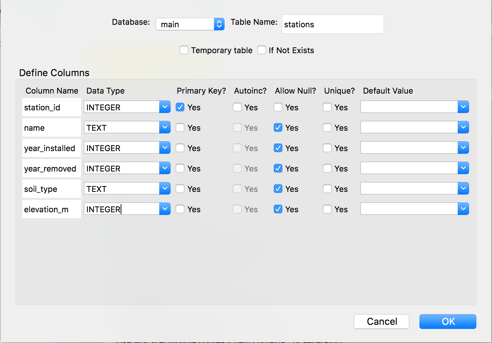
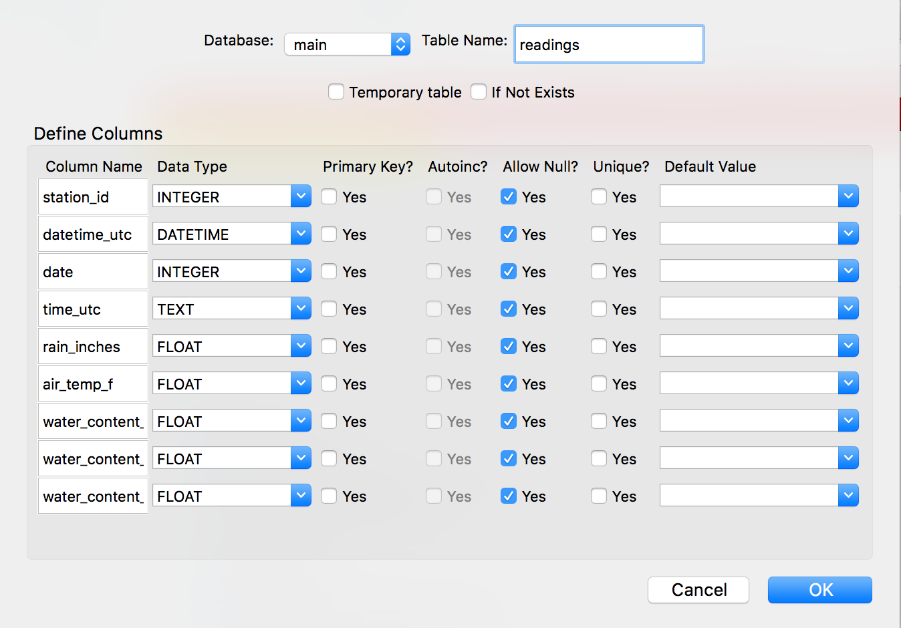

# Databases and SQL

## Background

There are three common options for storing data:

- Text files
- Spreadsheets
- Databases

Text files are the easiest to create and work well with version control.
We even saw how we could organize and search them in the Unix shell but we had to build the tools for even moderately complex analyses ourselves.
Spreadsheets are good for doing analysis but they don't handle large or complex datasets well.
**Databases, however, include powerful tools for search and analysis and are capable of handling large, complex datasets.**

- **A relational database is a way to store and manipulate information.**
- Databases are arranged as tables.
- Each table has columns (also known as fields) that describe the data, and rows (also known as records) which contain the data.

When we are using a spreadsheet, we put formulas into cells to calculate new values based on old ones.
When we are using a database, we send commands (usually called queries) to a database manager: a program that manipulates the database for us.
**This is analogous to what we saw with the Unix shell.**
Here, the database manager reads the user's command, retrieves and manipulates data from the database according to what the user asked for, and returns it for display.

## Getting Started with SQLite Manager

Our database manager is SQLite and we'll be using a software application that wraps SQLite, what we'll call a **client** for SQLite.
That client is called SQLite Manager and it is available as a plug-in for Mozilla Firefox.
**Go ahead and open SQLite Manager from Firefox.**

### Creating and Populating a New Database

1. At the top menu, select **Database** -> **New Database.**
2. We'll call our new database **iron.**
3. SQLite3 manages databases that are stored as single files on a computer's file system. So, after we click **OK** we'll be prompted to save the database as a file. **Save it to your Desktop as `iron.sqlite`.**
4. Start the import **Database** -> **Import.**
5. Select the file to import: `iron_metadata.csv`
6. Give the table a name that matches the table's contents. I like to choose a plural noun that describes the data represented by the rows. We'll call it **stations.**
7. Here the first row has column headings, so **check the 'First row contains column names' box**
8. Use the defaults of **Fields separated by: comma** and **Fields enclosed by: double quotes.**
9. After you click **OK** at the bottom, you're asked if you want to modify this table. Click **OK.**
10. Modify the table's fields according to the table below.
11. **After manually setting the data types,** click **OK.**

**Now we do the same for the `iron.csv` file, which contains the measurements at each station. We'll call this table `readings`.**

## Getting Started

### Our First Query

Let's write a query to find out which species are represented in the survey data.

    sqlite> SELECT station_id, name FROM stations;

**What happened? Let's go to the whiteboard for this.**

- The word `SELECT` here is the most common command we see in SQL. It tells the database manager we want to retrieve some rows.
- The word `FROM` tells the database manager which table we want to retrieve those rows from. It's followed by the name of that table, which here is `stations`.
- The words `station_id` and `name` are the names of two of the columns in the `stations` table. Column names follow the `SELECT` statement, indicating that those are the only columns we want to see in the output.
- The words `SELECT` and `FROM` are capitalized here by convention; it's not required to capitalize them but it helps make your code more readable which is very important.

**Throughout today's lesson I will be typing SQL commands in all capitals and the names of columns in lowercase to help you distinguish them from the names of tables and columns in the data. I encourage you to try to do the same but you can type these commands however you want; they'll work just the same.**

    sqlite> select station_id, name from stations;

**Finally, the semicolon.**
The semicolon is very import in SQL.
It tells the database manager that the command we're typing is finished.
It's not required in SQLite Manager, but other clients may require you to type it before it can process your SQL statements.

### The SELECT Statement

**Let's get more familiar with the SELECT command.**
We can re-order the columns in the output simply by swapping their order in our query.

    sqlite> SELECT name, station_id FROM stations;

One thing that's neat about SQL, compared to other languages like R or Python, is that SQL is **declarative.**
**That means that in SQL, we tell the computer what we want to happen, not how to do it.**

For example, with the `SELECT` command, I tell the computer what columns I want to see from the `readings` table, **I don't tell it how to retrieve or display the data, only what I want to see.**

As a shortcut, we can select all of the columns from a table using the wildcard:

    sqlite> SELECT * FROM stations;

### Challenge: Selecting a Column

**Write a query to select the `name` and `soil_type` columns from the `stations` table.**

## Removing Duplicates

Let's answer some real questions about this dataset.
**For starters, on what dates were readings made?**

    sqlite> SELECT date FROM readings;

**What's the problem with this result?**

    sqlite> SELECT DISTINCT date FROM readings;

Here, the results are returned in the order in which they appear in the table.
**It's important to realize that the database manager doesn't return rows in a predictable order.**
We'll see later on how we need to factor that into our construction of more complex queries.
For now, you should know if we want to specify the order of rows in the output, we need to use the `ORDER BY` clause.
**For instance, if we want to sort the results in descending date order, we would write:**

    sqlite> SELECT DISTINCT date FROM readings ORDER BY date DESC;

By default, the output is in ascending order.
That means there is an implicit `ASC` key after each column name in the `ORDER BY` clause.

    sqlite> SELECT DISTINCT date FROM readings ORDER BY date ASC;

We can order by multiple columns.
**For instance, we can sort the `readings` table first by `station_id` and then by `date` within each station group.**

    sqlite> SELECT DISTINCT station_id, date FROM readings ORDER BY station_id, date;

Note that when we use the keyword `DISTINCT` with two columns, we get all unique pairs between those two columns.
**CHALLENGE:** In the last `ORDER BY` clause, swap the order of `station_id` and `date`. What changed?

**Note that we don't actually have to display a column to order by it.**

    sqlite> SELECT DISTINCT date FROM readings ORDER BY datetime_utc DESC;

**Why does this output look funny, though?**
Typically, when we ask computers to sort text labels, they are sorted alphanumerically.
It turns out that SQLite needs some extra help to understand how to order columns of the `datetime` type.
We need to explicitly tell SQLite that the `datetime_utc` column should be interpreted as a `date` type column.

    sqlite> SELECT DISTINCT date FROM readings ORDER BY date(datetime_utc) DESC;

**Because we were careful to format our `date` column as `YYYYMMDD` (year, month, and then day, with single-digit month and day number padded with a leading zero), it is automatically in correct date order when we apply a default alphanumeric sorting.**

The `date()` function here is one of several built-in functions in SQL.
This function, like some others, performs what is called **type casting**; it converts a column from one data type to another.

## Calculating New Values

In addition to selecting columns that already exist in our table, we can calculate values in a new column as part of our queries.
**Let's say, for instance, that we want to look at air temperature in degrees Celsius instead of degrees Fahrenheit.**

    SELECT date, (air_temp_f - 32) * (5/9.0)
      FROM readings;

When we run the query, the expression `(air_temp_f - 32) * (5/9.0)` is evaluated for each row and appended to that row, in a new column.
**Why did I write nine as `9.0` instead of `9`?**

    SELECT date, (air_temp_f - 32) * (5/9)
      FROM readings;

When we only use integers in the math problem above, SQLite returns the result as an integer.
The quantity `5/9`, because it is a decimal number less than 1, is equal to zero in SQLite.
When we calculate `5/9.0`, however, SQLite recognizes that there is a decimal number in the calculation and will therefore output the answer as a decimal number.
**This is a case of automatic type casting in SQL.**

Expressions can use any fields, any arithmetic operators `(+, -, *, and /)` and a variety of built-in functions.
**For example, we could round the values to make them easier to read.**

    SELECT date, round((air_temp_f - 32) * (5/9.0), 2)
      FROM readings;

### Challenge: Changing the Units

Write a query that returns the `air_temp_f` column in degrees Kelvin.
The formula for conversion from degrees Fahrenheit to degrees Kelvin is: `[K] = ([°F] + 459.67) ×  5⁄9`.

## Filtering

**One of the most powerful features of a database is the ability to filter data, i.e., to select only those records that match certain criteria.**
For example, let's say we only want data on readings where the air temperature is above freezing (32 degrees F).
We need to add a `WHERE` clause to our query:

    SELECT * FROM readings
     WHERE air_temp_f > 32;

**The database manager executes this query in two stages.**

- First, it checks at each row in the `readings` table to see which ones satisfy the `WHERE` clause.
- It then uses the column names following the `SELECT` keyword to determine which columns to display.

This processing order means that we can filter records using WHERE based on values in columns that aren't then displayed.
**We can confirm that a subset of records is returned by looking at the bottom of SQLite Manager.**
The "Number of rows returned" should be smaller than the total number of rows in the table (unless our `WHERE` clause specified a condition that all rows meet).

Here, we select all the readings after August 10, 2016:

    SELECT * FROM readings
     WHERE date > 20160810;

**Again, because we used a `YYYYMMDD` format for the `date` column, we can use simple greater-than/ less-than queries to subset by date.**

If we want to combine the last two queries, we can use the keywords `AND` and `OR`.

    SELECT * FROM readings
     WHERE (air_temp_f > 32) AND (date > 20160810);

**Note that while the parentheses are not needed here, they make our queries much easier to read. Also, when we use `AND` and `OR` together they do become necessary to ensure that the database manager combines the conditional statements in the way we intended.**

### Challenge: Filtering

Write a query that returns readings with rainfall amounts (`rain_inches`) greater than zero.
**Bonus:** Check that there was never any rainfall recorded when the air temperature was below zero.

## Building More Complex Queries

**Let's say we want to select the records for multiple stations.**
We could write the query this way...

    SELECT * FROM readings
     WHERE (station_id = 1) AND (station_id = 2);

If we have a lot of stations, this could get pretty tedious, and tedium is what we're trying to avoid by using computers!

    SELECT * FROM readings
     WHERE station_id IN (1, 2);

Similarly, we might want to find these stations in the `stations` table.

    SELECT * FROM stations
     WHERE name IN ('Sky Mtn', 'Smuggler Mtn');

**In this case, because all the stations we're interested in have similar names, we can also filter by partial matches using the wildcard character.**
When we use partial matching, we have to use the `LIKE` keyword.

    SELECT * FROM stations
     WHERE name LIKE '% Mtn';

There are several similar matches we could try to get the same result:

    SELECT * FROM stations
     WHERE name LIKE '% Mtn' OR name LIKE 'S%';

**As we begin to build more complex queries, it's best to...**

- Start with something simple;
- Then add more clauses one by one;
- Testing their effects as we go along.

For complex queries, this is a good strategy, to make sure you are getting what you want.
Sometimes it might help to take a subset of the data that you can easily see in a temporary database to practice your queries on before working on a larger or more complicated database.

**When the queries become more complex, it can be useful to add comments.**
In SQL, comments are started by `--`, and end at the end of the line.

    -- Get readings from Sky and Smuggler Mtn stations only
    SELECT * FROM readings
     WHERE station_id IN (1, 2)
    -- Whenever the air temperature was above freezing
       AND (air_temp_f > 32);

### Challenge: Putting it All Together

Let's try to combine what we've learned so far in a single query.
Using the `readings` table, write a query to display the `station_id`, `date` and `time_utc` fields in addition to the air temperature in degrees C (rounded to two decimal places) at 12 noon time ordered by `station_id` and then by `date`.

    SELECT station_id, date, time_utc,
        round((air_temp_f - 32) * (5/9.0), 2)
      FROM readings
     WHERE time_utc = '12:00'
     ORDER BY station_id, date;

**It's important we understand the order in which the database manager executes these statements.**

1. Filtering rows according to `WHERE`;
2. Sorting results according to `ORDER BY`;
3. Displaying requested columns or expressions.

## Missing Data

Real-world data are never complete--there are always holes.
**Databases represent these holes using a special value called `NULL`.**
`NULL` is not zero, `NULL` is not False, and `NULL` is not the emptry string; it is a one-of-a-king value that means "nothing here."
Dealing with `NULL` requires a few special tricks and some careful thinking.

To start, let's look at readings from the station with `station_id` 5.

    SELECT * FROM readings
     WHERE station_id = 5;

**If we scroll to the bottom,** it appears that the last three records are missing values for the water content fields.
More accurately, the values in the fields are `NULL`.
`NULL` doesn't behave like other values.
**How might we try to find other records like this where the `water_content_2inch` column is null?**

    SELECT * FROM readings WHERE water_content_2inch = NULL;
    SELECT * FROM readings WHERE water_content_2inch != NULL;
    SELECT 2 = 2;
    SELECT 2 = 3;
    SELECT 2 = NULL;
    SELECT NULL = NULL;

It turns out, we need a special test for `NULL`.

    SELECT *
      FROM readings
     WHERE water_content_2inch IS NULL;

    SELECT *
      FROM readings
     WHERE water_content_2inch IS NOT NULL;

`NULL` can make trouble for some of queries.
Suppose we want to see all the records from `station_id` 5 but exclude those with a 2-inch water content at or above 0.05.

    SELECT *
      FROM readings
     WHERE station_id = 5 AND water_content_2inch < 0.05

**What we don't get in this query are all those records where `water_content_2inch` is `NULL`.**
To get those records, we need to add another condition.

    SELECT *
      FROM readings
     WHERE station_id = 5 AND
        (water_content_2inch < 0.05 OR water_content_2inch IS NULL);

Similarly, what is wrong with the following query?

    SELECT * FROM readings WHERE water_content_2inch IN (0.049, NULL);

## Aggregation

**Aggregation allows us to combine results by grouping records based on value and calculating combined values in groups.**
Let's go to the readings table and find out how many records there are.
Using the wildcard simply counts the number of records (rows).

    SELECT count(*) FROM readings;

We can also calculate the rainfall across all those readings!

    SELECT count(*), sum(rain_inches)
      FROM readings;

There are other aggregation functions that allow us to compute summary statistics.

    SELECT min(rain_inches), max(rain_inches), avg(air_temp_f)
      FROM readings;

These numbers may be useful for validating or exploring our data; for instance, is the maximum rainfall in inches, 0.2, a reasonable value?
It's also neat to think about the total amount of rainfall across all these stations.
However, that quantity isn't very scientifically meaningful because it spans so many different hours, days, and stations.
**If we want to aggregate within groups, such as within dates or within stations, we can add a `GROUP BY` clause to our query.**
For instance, here's a count of the number of records for each station:

    SELECT station_id, count(air_temp_f)
      FROM readings
     GROUP BY station_id;

`GROUP BY` tells SQL what field or fields we want to use to aggregate the data.
**If we want to group by multiple fields, we give `GROUP BY` a comma-separated list.**

    SELECT station_id, date, count(air_temp_f)
      FROM readings
     GROUP BY station_id, date;

### Challenge: Aggregation

Write queries that return:

- What is the average temperature at each station?
- What is the maximum rainfall at each station?

Can you modify the above queries combining them into one?

### Care in Aggregation

Let's say we want to find out the average temperature at station 5 on each date and we write a query like this.

    SELECT station_id, date, time_utc, avg(air_temp_f)
      FROM readings
     WHERE station_id = 5
     GROUP BY date;

**We absent-mindedly included the `time_utc` column, maybe because we were typing quickly or because we wanted to group by values in this column across all stations.**
At any rate, we have a column in our `SELECT` clause that is neither in the `GROUP BY` clause nor called with an aggregation function like `avg()`.

- What does the `time_utc` column mean in the context of this query?
- Why is it populated?

When the `GROUP BY` clause is processed by the database manager, it groups the records that correspond to the groups we defined.
Then, the database manager has to figure out what values should appear in each column for each group.
In the `SELECT` clause we specified:

- `station_id`: This is easy because of our `WHERE` clause: there is only one value to choose from.
- `date`: This is also easy, because we grouped by this column; there should be one unique value in this column for each output row.
- `avg(air_temp_f)`: Here, the database manager takes the mean of each group of air temperatures for each date.

**The problem is that the database manager wasn't told how to aggregate the `time_utc` field.**
When SQLite is asked to aggregate a field but isn't told how to do so, it chooses an actual value that appears in the input set of values *more or less at random.*
For instance, if we see `23:40` in the `time_utc` field on `20160731`, this could be because this was the only time when a measurement was made on this day or because the first value in the set of `time_utc` values was `23:40`, or for an entirely different reason.

**It's very important for you to know that this is non-standard behavior and will not work in all database management systems.**
If you use PostgreSQL, for instance, you will get an error.
PostgreSQL will not process this query, it will give you an error to the effect that the `time_utc` column is not included in an aggregation function nor in a `GROUP BY` clause.
**Personally, I like getting this error message because, in such a case, I have done something wrong. It's meaningless to interpret a non-aggregated column like `time_utc` when other columns have been aggregated.**

## Conclusion and Summary

### Other Resources

* On correct aggregation: [Do you use GROUP BY correctly?](https://www.psce.com/blog/2012/05/15/mysql-mistakes-do-you-use-group-by-correctly/)
* The best book on SQL is [SQL: Visual Quickstart Guide (by Chris Fehily, 3rd Edition)](http://www.fehily.com/books/sql_vqs_3.html)
